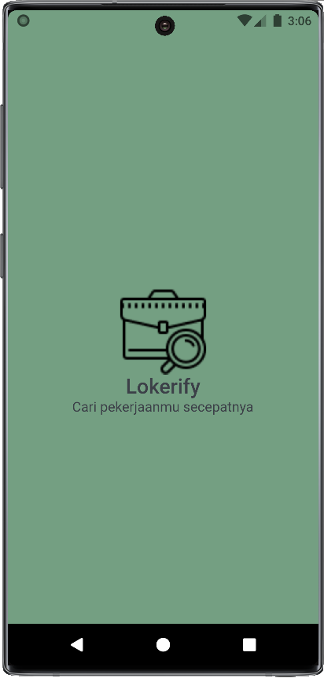
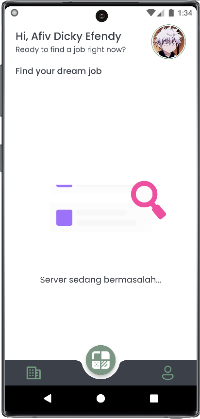
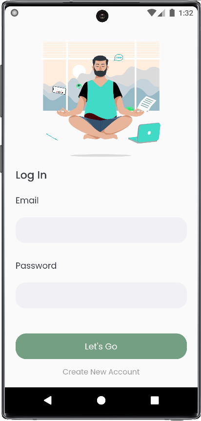
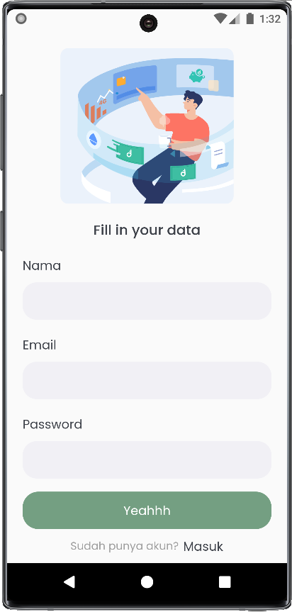
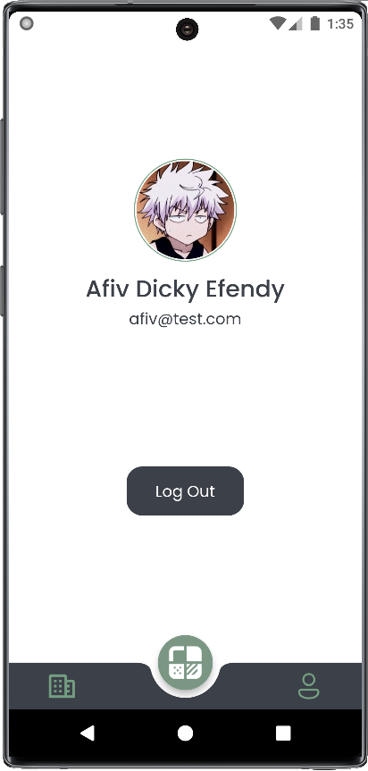

# lokerify

Project ini dibuat untuk pengumpulan mini project kegiatan kampus merdeka NF Computer  

### Syarat yang harus dipenuhi:  

- [x] Minimal 5 page
- [x] Menggunakan navigation
- [x] UI tidak ada overflow
- [x] Menerapkan Stateful dan Stateless widget
- [x] Menerapkan github action

### Bonus nilai:  

- [x] Menerapkan state management
- [x] Menerapkan design pattern
- [ ] Menerapkan responsive layout
- [x] Menggunakan unit testing

### Preview Apps

|                                   |                                 |
| --------------------------------- | ------------------------------- |
| Splash Page                       | Home Page (error data)          |
|  |     |
| Login Page                        | Register                        |
|       |  |
| Profile Page                      |                                 |
|     |                                 |
