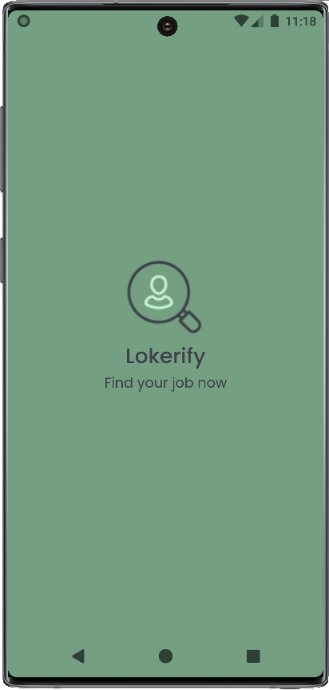
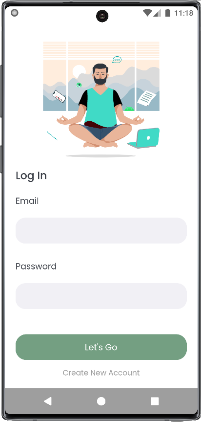
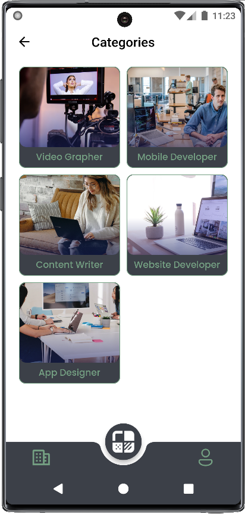

# lokerify

Project ini dibuat untuk pengumpulan mini project kegiatan kampus merdeka NF Computer  

### Syarat yang harus dipenuhi:  

- [x] Minimal 5 page
- [x] Menggunakan navigation
- [x] UI tidak ada overflow
- [x] Menerapkan Stateful dan Stateless widget
- [x] Menerapkan github action

### Bonus nilai:  

- [x] Menerapkan state management
- [x] Menerapkan design pattern
- [ ] Menerapkan responsive layout
- [x] Menggunakan unit testing

### Features

- Provider State Management
- Firebase Auth & Firestore
- Consume RESTful API
- Flutter Unit Test with Mockito

### Preview

|                                     |                                     |
| ----------------------------------- | ----------------------------------- |
| Splash Page                         | Error State                         |
|    |     |
| Login Page                          | Register Page                       |
|     |  |
| Home Page                           | Detail Page                         |
|   |    |
| Category Page                       | Profile Page                        |
|  |   |
| Applied State                       |                                     |
|   |                                     |
